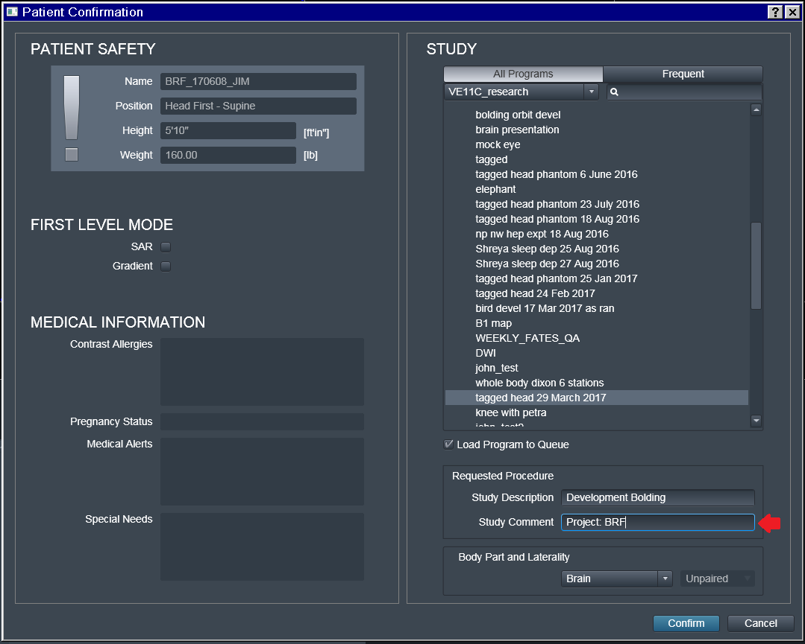
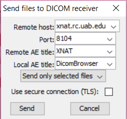
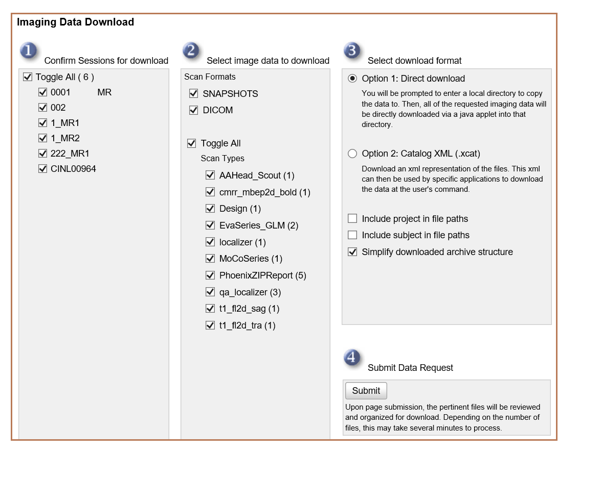

# XNAT

## About XNAT

XNAT is an open-source imaging informatics platform developed at Washington University with a deployment here at UAB. It facilitates both MRI data storage in a common structure as well as sharing across labs both internal and external to UAB. It is free to use for all researchers at UAB. More information can be found at [xnat.org](https://www.xnat.org).

## Why Use XNAT

- Can send data directly from the scanner to XNAT without copying to flash drive
- Easy to add collaborators to projects and share data across labs
- Can act as a data backup
- Common storage system makes data preprocessing pipelines more generalizeable

This documenatation contains information on how to create and manage accounts, create projects, and upload and download data.

## User Registration and Accounts

Permissions in XNAT for accessing and manipulating data are governed through each user's account. A user must have a valid and enabled account in order to log in and work with data in XNAT.

!!! note

    An XNAT project can be set to allow guest access to allow users to view and download public data without an account. By default this setting is turned off, and must be enabled by an Administrator.

### Account Creation

There are 3 ways in which a user account can be created:

1. The user can register an account for themselves
2. A new user can be invited to join XNAT by a current user who is a project owner
3. A new user account can be created by an XNAT administrator

### Registering Your Own Account

In a standard XNAT installation, user accounts must be created by either the user themselves or by the site administrator. Users will be given the option of registering for an account when they first visit the site. At UAB, navigate to xnat.rc.uab.edu/xnat and click Register on the home page. The following registration page will appear

Fill out all of fields and submit registration. Your account should be ready to use.

### Being Invited to Join XNAT

An existing project owner may wish to invite you to join XNAT with the purpose of granting you access to their project data. If they do so, you will receive an email from XNAT with a specially coded link called a Project Access Request. Clicking on that link will take you to a customized version of the account registration page, where you can either log in with an existing account, or create a new one.

### Contacting a Site Administrator

If you have any trouble registering an account (or with anything else in this guide), message one of the site administrators or visit Rearch Computing office hours on Zoom. Office hours are from 10:00-12:00 on every Monday and Thursday. Zoom links can be found at rc.uab.edu.

Admins:  

- Matthew Defenderfer: <mdefende@uab.edu>

## XNAT Projects

There are several different methods that you can use to upload files to XNAT. In order to make sure your files are properly organized and accessible to you and others working on your project, it is important to first create an XNAT project before uploading anything.

!!! note

    All files uploaded to XNAT that you do not assign to a specific project will end up in the prearchive. The prearchive is accessible only to administrators, and so you will need an administrator's assistance to gain access to your files and to move them to the correct project.

### Creating a New Project

On the Home Page, click New >> Project from the dropdown menu to create a new project. After selecting the Project Title and an abbreviated version of your title for your Running Title, you will need to set a Project ID. Once set, this Project ID can never be changed, and will be used by XNAT and other programs to send files to your project and to reference your project for various other purposes.

You can also write a description for your project, assign searchable tags to it, or assign your project to a PI. None of these things are necessary, and all can be added or changed at a later time.

### User Roles and Permissions

XNAT defines 3 common project roles: Owners, Members, and Collaborators. Project owners are able to add new users to a project and assign roles. Each different role has different permissions for data access:

| Role/Activity      | Owners | Members | Collaborators |
|--------------------|--------|---------|---------------|
| Create Data        | C      | C       |               |
| Read/Download Data | R      | R       | R             |
| Update Data        | U      | U       |               |
| Delete Data        | D      |         |               |

User Permission Structure

- Project Owners can read, insert, modify, and delete anything (and everything) associated with your project. They can also add additional users to your project and modify the data types associated with your project.
- Project Members can manage the data in your project. They can read, insert, and modify subjects and experiments in your project. They cannot modify the project users and data types.
- Project Collaborators have read-only access on all of the data in your  project. They cannot insert or modify data owned by your project. They can download your data and use it within their projects.

### Managing User Access

Users can be added to your project and assigned roles using the Manage User Access Dialogue

## File Management

### Uploading Files

#### Uploading from the scanner

One of the best ways to get your files to XNAT is to send them directly from the scanner immediately after the scan session ends. Anything sent using this method will go to XNAT, but if you want your files to be associated with your porject, and want to access your files without the help of an administrator, you should make sure you know your project's Project ID. If you are collection data for a new project, it only takes a few minutes to [create a new project in XNAT](projects.md#creating-a-new-project)

In order to associate the scans with your project, you need to add a tag with your Project ID during the scan setup process. Once you make it to the Patient Confirmation page, locate the **Study Comment** entry under **Requested Procedure**. Input "Project: *your project ID*" with no quotes. For example, if a Project ID was BRF, you would insert "Project: BRF" with no quotes.

Once you have completed data collection, locate your data in the Patient Browser. Select the folder with your patient's name. Do not select any of the scans, only select the folder with the patient name.

In the Patient Browser window, select Transfer >> Send To and select XNAT. Select Send to queue your files to be sent to XNAT. This process can be slow, but will operate in the background of the computer, allowing subsequent investigators to begin scanning. Send to OSIRIX in the same way to have a  backup.

<!-- markdownlint-disable MD046 -->
!!! note

    Only files in DICOM format can be sent to XNAT from the Prisma scanner. Magnetic resonance spectroscopy images cannot be sent to or stored on XNAT. These scans will have to be downloaded directly from the scanner.
<!-- markdownlint-enable MD046 -->

#### DicomBrowser

DicomBrowser can be used to view images stored on your computer or flash drive and can upload them to XNAT. It is available on Mac, Windows, and Linux from <https://wiki.xnat.org/xnat-tools/dicombrowser>.

You can open individual images or folders of images by clicking File >> Open and navigating to the location of the files on your computer. Once DicomBrowser loads your files, you can select one or more files or folders and click View >> View selected images to open up a toolbar that allows you to view, animate, and process your files. If you save after processing your files, DicomBrowser will overwrite the original image files, so it is always important to have a backup copy of your data.

Uploading files using DicomBrowser is easy but not very intuitive. Once your files are open in DicomBrowser, click on the folder in the left sidebar containing all of the files you want to upload to your project. You will see a long list of tags which represent additional information stored in each image on your computer. Find the tag marked Study Description and change the text in the column labeled "Value" to the Project ID of your project.

With your files still highlighted, click File \>\> Send to open up dialogue box. Change the default values to the values below:

- Remote host: xnat.rc.uab.edu
- Port: 8104
- Remote AE Title: XNAT
- Local AE Title: DicomBrowser

### Downloading Files

#### Using XNAT's Downloader

XNAT's downloader requires Java to run, so make sure you have the latest version of Java installed on a Java-compatible browser like Internet Explorer or Safari

In order to begin your download, click your project file and select Download Images from the actions bar on the right side of the screen.

The next page allows you to select imaging sessions and scan types you would like to download. Click Submit.

You will be taken to a new page, and will have to wait several seconds for a Java window to appear, which allows you to select a destination folder on your computer and then click Start to download.

If the Browse and Start buttons do not appear on this page, Java is not functioning on your browser (See Installing Java on the previous page of this guide).

