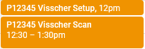

# Scheduling Scans and Space

## Calendars

Users that would like to view the MRI and interview room schedules or book time slots for their studies must have access to the CINL calendars. Two Google calendars are dedicated to our two Inverview Rooms and two calendars for the scheduling the Prisma, one for requesting scan time and the other for CINL personnel to confirm requests. To gain access to the following 4 google calendars, please send a request to Eleanor Yourich at elewis1@uabmc.edu.

- CINL Prisma Request
- CINL Prisma Confirmed
- CINL Highlands Interview Room 1
- CINL Highlands Interview Room 2

You will need to provide Eleanor your email address and it is easiest to use a Gmail address (which will also integrate it into their already existing Google calendar).

!!! warning

    This is a Google calendar, so no PHI should ever be entered.

When requesting a scan on the CINL Prisma Request calendar, include the Study ID / P-number, along with PI name, for example: P18XXX \<PI last name\>. Please refer to the [Prisma Calendar How-To Guide](https://uab365.sharepoint.com/:b:/r/sites/som/circ/cinl/Shared%20Documents/Prisma%20Calendar%20How-To-rev_2.11.2022.pdf?csf=1&web=1&e=CPXahh) as it addresses each step in requesting time on the scanner.

### CINL Setup Time

Note the 15 minute buffer time after clinical each weekday. This buffer is to provide a safeguard in case clinical needs additional time to wrap up. Keep in mind that this is a possible outcome when scheduling your scans over that buffer. Please reach out to Eleanor Yourich with any issues.

### User Setup Time

There is up to a 30 minute window that we allow for setup and teardown (enough time to get the participant set up and then out of the scanner afterwards), and this 30-minute time can be scheduled separately from the actual scan time. If scan setup exceeds 30 minutes, then this extra time is billed for the study. Scan time is billed a minimum of 1 hour, and then in 15 minute intervals for time over 1 hour.

!!! note

    We also ask Users to be mindful of the time requested on the scanner such that if the session is only 1.5 hours including setup time, that they do not request longer amounts of time.

### Example Calendar Event

<!-- markdownlint-disable MD033 -->
<figure markdown="1">

</figure>

## Requesting a Scanner Operator

If you need someone to run the scan for your study, you can request a MRI technologist or Operationally (Level 2) certified individual trained to run your scan. On the calendar request, include "Need Tech". After the MR tech Elizabeth has learned how to perform your scan, she should be able to assist with research scans scheduled between 11:30AM - and completed by 8:00PM on weekdays.

At least one MRI Safety trained member of your team will have to be present to instruct the MRI operator on your study's scanning protocol and if there are any particular nuances regarding how you like your scans to be acquired. We have weekend coverage from 9AM to 5PM most Saturdays and Sundays. Dr. Ryan Willoughby usually provides weekend coverage, but he must be familiar with your protocol before requesting him to scan. He is also not a registered MRI technologist so any studies that require a tech specifically will need to done during Elizabeth's hours.

You must indicate on the Prisma Request Calendar if you need someone to scan for you and please refer to the Prisma Confirmed calendar when CINL staff is absent. If you wish, email Eleanor with your group's inquiry about availablity for your research scan at a particular date or time, but it is not required.

## Scan Cancellations

All cancellations must be reported in two ways:

1. Use the CINL Request calendar to request a cancellation over the confirmed scan time you would like cancelled. Indicate your intent to cancel on the CINL Prisma Request calendar alongside the confirmed time (for example: “Cancel P18XXX (PI last name) scan")
2. Send a cancellation notice to the CINL Listserv. Email CINL-NOTICE@LISTSERV.UAB.EDU to indicate that the time slot on the scanner will be available. This list can also be used to let everyone know if an important piece of equipment goes down. Please do not use the list for anything else.

### Subscribing to CINL-NOTICE Listserv

[Click here](mailto:listserv@listserv.uab.edu?%E2%80%A8&body=sub%20cinl-notice), or alternatively, send an email to listserv@listserv.uab.edu with the email body as 'sub cinl-notice'. After which you’ll receive an email to confirm your email address. After confirming your email address, you would start receiving cancellation emails from others on the list as well as be able to send your own notifications.  

### No Show Policy

If your research group does not show for the scan without cancelling via both the calendar and Listserv, then you will be billed for the amount of time booked on the calendar. This includes same day or day-before cancellations.

!!! note

    Penalization ONLY occurs for no shows when the research group itself also does not show for the scan or appropriately indicate that the scan time is no longer needed (refer to 2 step cancellation process above).  
