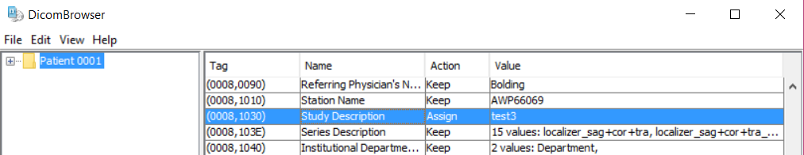

# File Management

## Uploading Files

### Uploading from the scanner

One of the best ways to get your files to XNAT is to send them directly from the scanner immediately after the scan session ends. Anything sent using this method will go to XNAT, but if you want your files to be associated with your porject, and want to access your files without the help of an administrator, you should make sure you know your project's Project ID. If you are collection data for a new project, it only takes a few minutes to [create a new project in XNAT](projects.md#creating-a-new-project)

In order to associate the scans with your project, you need to add a tag with your Project ID during the scan setup process. Once you make it to the Patient Confirmation page, locate the **Study Comment** entry under **Requested Procedure**. Input "Project: *your project ID*" with no quotes. For example, if a Project ID was BRF, you would insert "Project: BRF" with no quotes.

Once you have completed data collection, locate your data in the Patient Browser. Select the folder with your patient's name. Do not select any of the scans, only select the folder with the patient name.

In the Patient Browser window, select Transfer >> Send To and select XNAT. Select Send to queue your files to be sent to XNAT. This process can be slow, but will operate in the background of the computer, allowing subsequent investigators to begin scanning. Send to OSIRIX in the same way to have a  backup.

<!-- markdownlint-disable MD046 -->
!!! note

    Only files in DICOM format can be sent to XNAT from the Prisma scanner. Magnetic resonance spectroscopy images cannot be sent to or stored on XNAT. These scans will have to be downloaded directly from the scanner.
<!-- markdownlint-enable MD046 -->

### DicomBrowser

DicomBrowser can be used to view images stored on your computer or flash drive and can upload them to XNAT. It is available on Mac, Windows, and Linux from <https://wiki.xnat.org/xnat-tools/dicombrowser>.

You can open individual images or folders of images by clicking File >> Open and navigating to the location of the files on your computer. Once DicomBrowser loads your files, you can select one or more files or folders and click View >> View selected images to open up a toolbar that allows you to view, animate, and process your files. If you save after processing your files, DicomBrowser will overwrite the original image files, so it is always important to have a backup copy of your data.

Uploading files using DicomBrowser is easy but not very intuitive. Once your files are open in DicomBrowser, click on the folder in the left sidebar containing all of the files you want to upload to your project. You will see a long list of tags which represent additional information stored in each image on your computer. Find the tag marked Study Description and change the text in the column labeled "Value" to the Project ID of your project.

With your files still highlighted, click File \>\> Send to open up dialogue box. Change the default values to the values below:

- Remote host: xnat.rc.uab.edu
- Port: 8104
- Remote AE Title: XNAT
- Local AE Title: DicomBrowser

## Downloading Files

### Using XNAT's Downloader

XNAT's downloader requires Java to run, so make sure you have the latest version of Java installed on a Java-compatible browser like Internet Explorer or Safari

In order to begin your download, click your project file and select Download Images from the actions bar on the right side of the screen.

The next page allows you to select imaging sessions and scan types you would like to download. Click Submit.

You will be taken to a new page, and will have to wait several seconds for a Java window to appear, which allows you to select a destination folder on your computer and then click Start to download.

If the Browse and Start buttons do not appear on this page, Java is not functioning on your browser (See Installing Java on the previous page of this guide).

